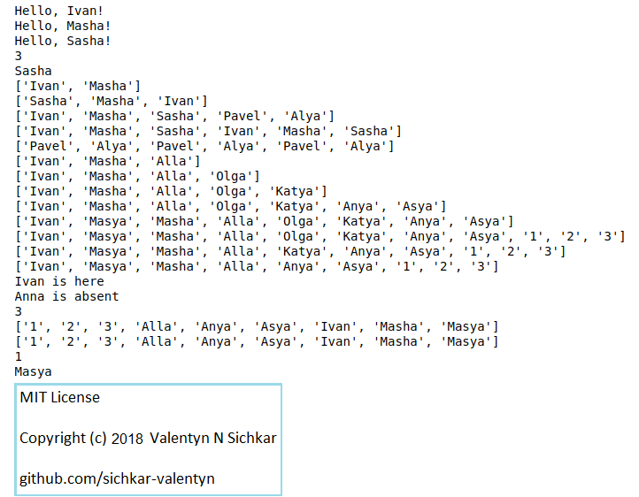

# Lists in Python
Examples how to create Lists and use them in Python

### Courses:
* Explore the course **"Convolutional Neural Networks for Image Classification"** here: https://stepik.org/course/53801/promo

### Reference to:
[1] Valentyn N Sichkar. Lists in Python // GitHub platform [Electronic resource]. URL: https://github.com/sichkar-valentyn/Lists_in_Python (date of access: XX.XX.XXXX)

## Description
Program shows how to create and use Lists in Python.

## Results of slicing

## MIT License
## Copyright (c) 2018 Valentyn N Sichkar
## github.com/sichkar-valentyn
### Reference to:
[1] Valentyn N Sichkar. Lists in Python // GitHub platform [Electronic resource]. URL: https://github.com/sichkar-valentyn/Lists_in_Python (date of access: XX.XX.XXXX)
